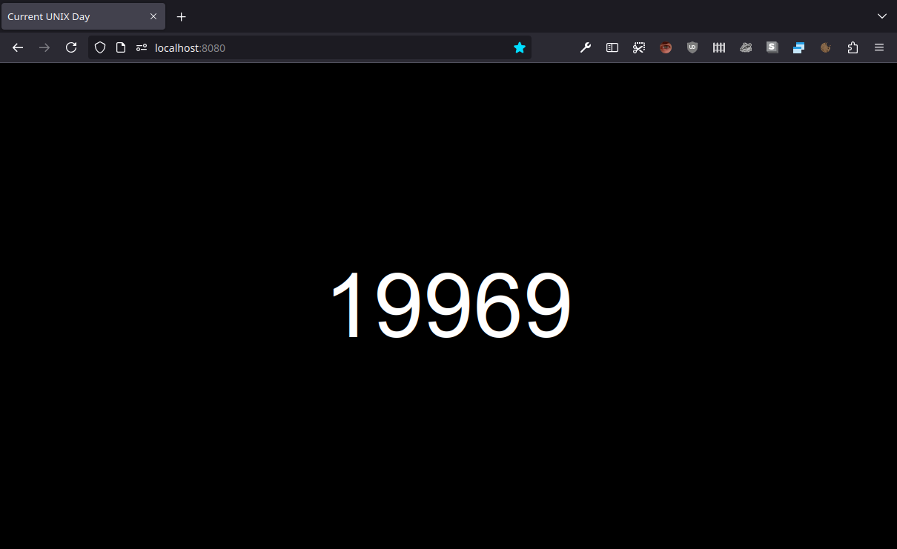

# UNIX Day

## Contents

* `unixday` package for Go.
* A web server, showing the current UNIX day, countdown style.

## Screenshot

## See also

* The [`ud` utility](https://github.com/xyproto/ud), which is written in C.

## General info

* Version: 1.0.0
* License: MIT
* Author: Alexander F. Rødseth &lt;xyproto@archlinux.org&gt;
